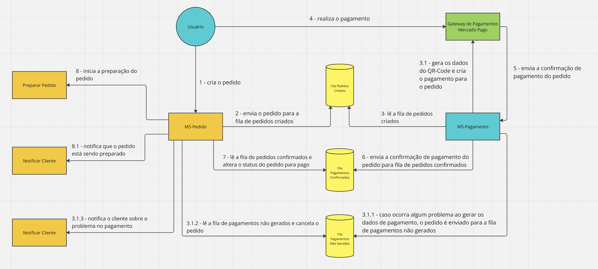

# Projeto Sistema de Pedidos

Este repositório contém o código do projeto do Tech Challenge .

## Pré-requisitos

Certifique-se de ter instalado em sua máquina:

- Java JDK
- Apache Maven
- Docker
- Docker Compose

## Passos para criar o JAR

1. Clone o repositório:

    ```bash
    git clone https://github.com/rodrigosmig/tech-challenge.git
    ```

2. Navegue até o diretório do projeto:

    ```bash
    cd tech-challenge
    ```

3. Execute o comando Maven para construir o arquivo JAR:

    ```bash
    mvn clean package -DskipTests
    ```

4. O arquivo JAR será gerado no diretório `target/`.

## Executar o Docker Compose

1. No diretório onde está o arquivo `docker-compose.yml`, execute:

    ```bash
    docker-compose up
    ```

Isso irá construir a imagem para execução da aplicação e iniciará os serviços conforme configurado
no `docker-compose.yml`.

## Kubernetes

1. Executar os seguintes comandos para criação dos componentes do cluster Kubernetes

```bash
kubectl apply -f sistema-pedidos-namespace.yaml
```

```bash
kubectl apply -f sistema-pedidos-network-configmap.yaml
```

```bash
kubectl apply -f sistema-pedidos-mysql-deployment.yaml
```

```bash
kubectl apply -f sistema-pedidos-app-deployment.yaml
```

O manifesto da aplicação já está apontando para uma imagem hospedada no repositório docker hub. Em caso de necessidade
de gerar e publica nova imagem, deve-se alterar o usuário e senha no arquivo POM.xml conforme abaixo:

```bash
   <auth>
       <username>usuario</username>
       <password>senha</password>
   </auth>
```

Em seguida executar a tarefa maven para criação e publicação remota da nova imagem:

```bash
mvn clean package -DskipTests jib:dockerBuild
```

2. Caso esteja executando localmente com o Docker Desktop executar o comando abaixo para realizar o
   encaminhamento de portas

```bash
kubectl port-forward service/sistema-pedidos-app-service 8080:8080
```

3. Caso de execução em ambiente remoto ou diferente do Docker Desktop pode optar por inicializar os
   componentes do ingress

```bash
kubectl apply -f nginx-ingress-rbac.yaml
```

```bash
kubectl apply -f nginx-ingress-deployment.yaml
```

## Open API and Swagger UI

1. É possível importar a coleção de API's para o postman utilizando a URL:

```bash
http://localhost:8080/v3/api-docs
```

2. É possível também utilizar a inteface gráfica do Swagger utilizando a URL:

```bash
http://localhost:8080/swagger-ui/index.html 
``` 

## Collections
- [Postman](https://ancient-dash-91c.notion.site/Collections-Postman-bca1db2d372f461aba8dbd2bda3d8c7c)


## Saga Pattern
Implementamos o padrão SAGA utilizando a abordagem de coreografia.
Como temos apenas dois participantes (MS-Pedido e MS-Pagamento)  da SAGA se comunicando entre si, achamos que não seria necessário uma lógica de coordenação e mais um serviço diferente para dar manutenção.
Caso tivéssemos mais participantes a abordagem de orquestração seria mais adequada, pois ficaria mais difícil rastrear quais participantes escutam determinadas filas e um risco maior de ocorrer dependências cíclicas por conta dos muitos participantes se comunicando entre si.

### **Ação Compensatória**

Quando o cliente cria um pedido automaticamente é criado um pagamento no serviço MS-Pagamento utilizando o serviço de pagamento externo Mercado Pago. Caso MS-Pagamento não consiga se comunicar com o Mercado Pago, será feito 4 novas tentativas. Caso não tenha sucesso será gerada uma ação compensatória para cancelar o pedido e informar o cliente.


